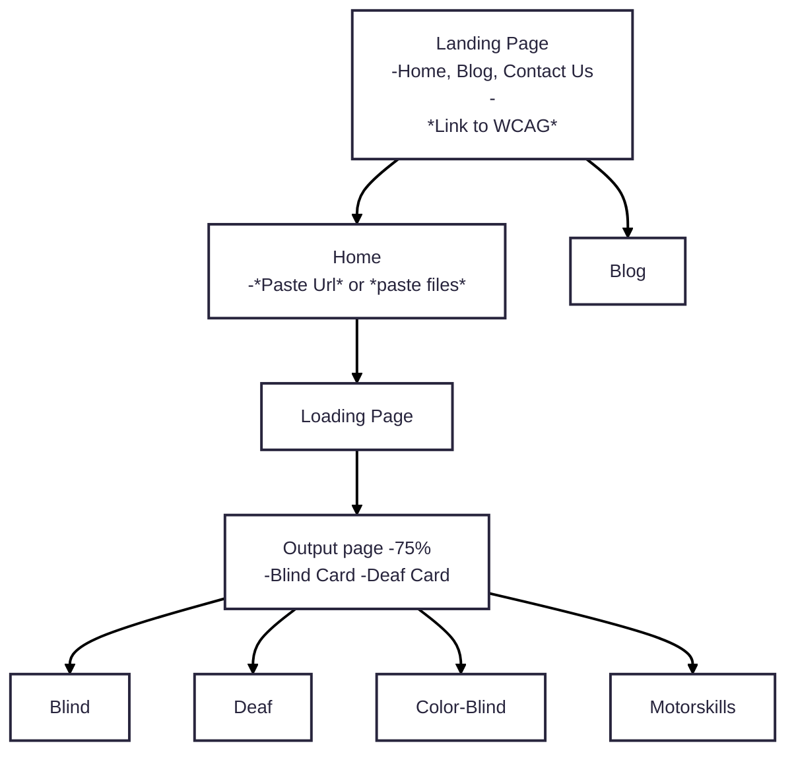

```mermaid
---
config:
  theme: redux
---
flowchart TD
    A["Landing Page
        -Home, Blog, Contact Us
        -
        *Link to WCAG*"] --> B["Home
        -*Paste Url* or *paste files*"] & C["Blog"]
    B --> D["Loading Page"]
    D --> E["Output page -75% 
        -Blind Card -Deaf Card"]
    E --> F["Blind"] & G["Deaf"] & H["Color-Blind"] & I["Motorskills"]

```
